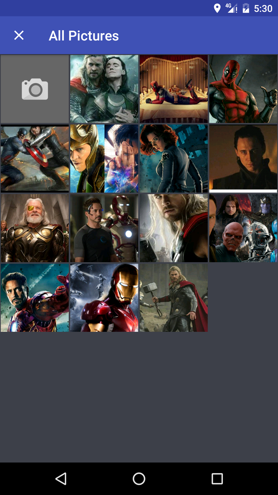
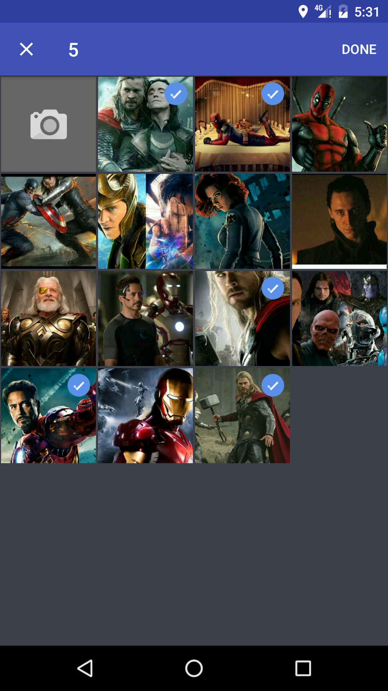
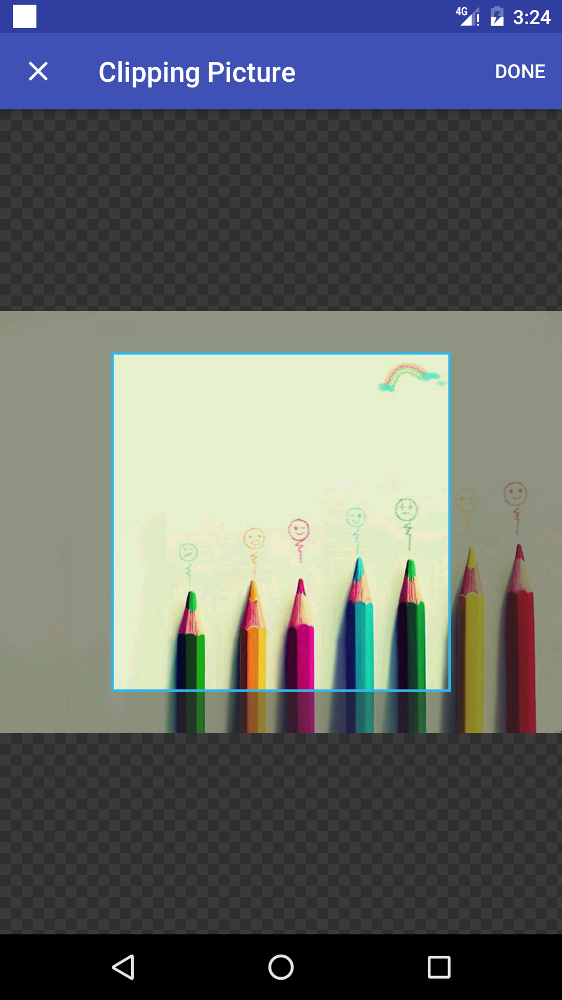

IPicker
======================================
A material design style pictures selector.

## Screenshot
  

## Usage
### Gradle

```
dependencies {
   	compile 'com.liuguangqiang.ipicker:library:0.1.1'
}
```

### Maven
```
<dependency>
  <groupId>com.liuguangqiang.ipicker</groupId>
  <artifactId>library</artifactId>
  <version>0.1.1</version>
  <type>aar</type>
</dependency>
```

### Manifest

```
<activity
     android:name="com.liuguangqiang.ipicker.IPickerActivity"
     android:screenOrientation="portrait"
     android:theme="@style/IPickerTheme" />
```

### Theme
```
<style name="IPickerTheme" parent="Theme.AppCompat.Light.DarkActionBar">
     <item name="colorPrimary">@color/color_primary</item>
     <item name="colorPrimaryDark">@color/color_primary_dark</item>
     <item name="colorAccent">@color/color_primary</item>
 </style>
```

### Open the picker
```java
IPicker.setLimit(1);
IPicker.open(context);
```

Receive the selected images by EventBus.

```
@Subscribe
public void onEvent(IPickerEvent event) {
}
```

## License

    Copyright 2016 Eric Liu

    Licensed under the Apache License, Version 2.0 (the "License");
    you may not use this file except in compliance with the License.
    You may obtain a copy of the License at

       http://www.apache.org/licenses/LICENSE-2.0

    Unless required by applicable law or agreed to in writing, software
    distributed under the License is distributed on an "AS IS" BASIS,
    WITHOUT WARRANTIES OR CONDITIONS OF ANY KIND, either express or implied.
    See the License for the specific language governing permissions and
    limitations under the License.